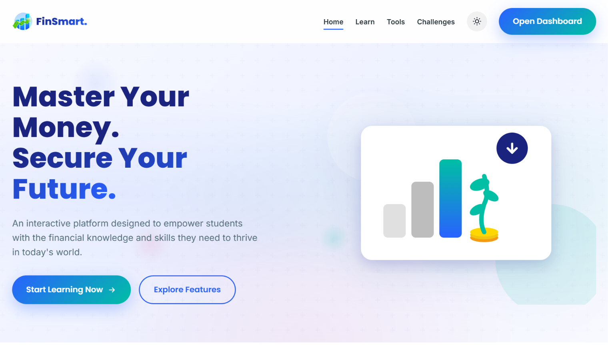
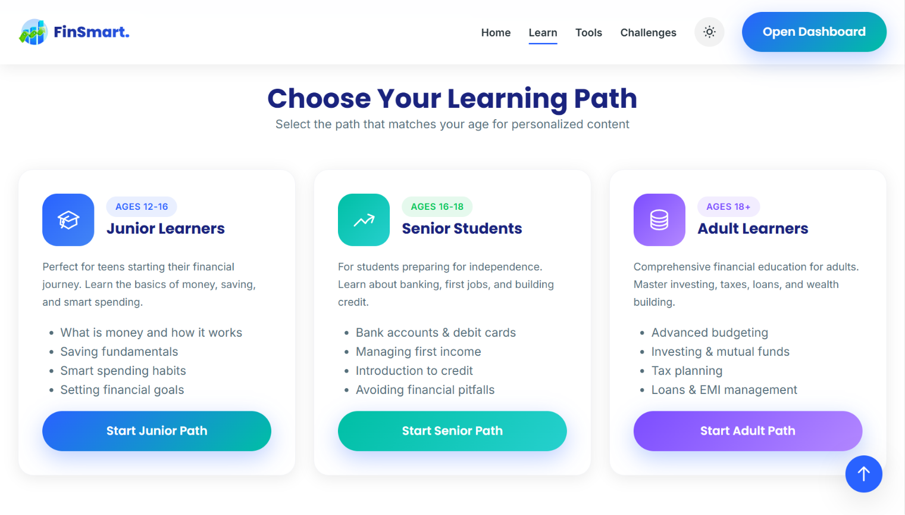
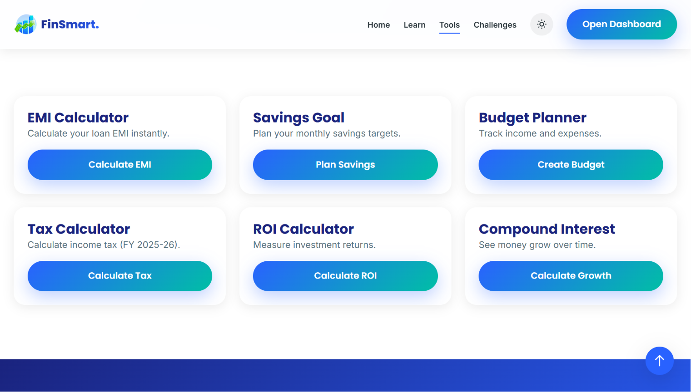
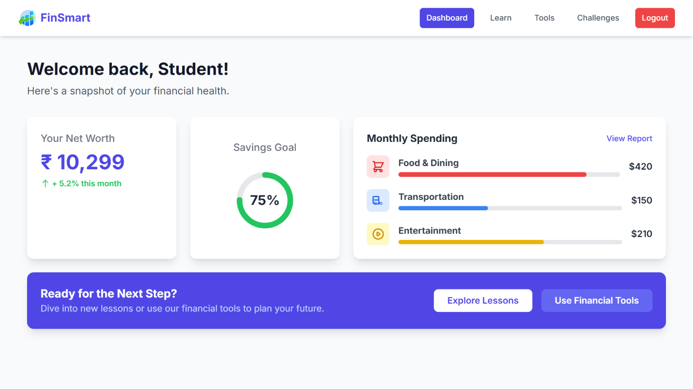

<div align="center">


# FinSmart

**Master Your Money. Secure Your Future.**

An interactive financial literacy platform built for students — practical budgeting, investing, and money-management tools instead of just theory.


-blue)

**[🔗 Live Demo](https://appfinsmart.netlify.app/)**

</div>

---

## 📖 Table of Contents

- [About](#about)
- [Screenshots](#-screenshots)
- [Features](#features)
  - [Learn](#-learn)
  - [Tools](#-tools)
  - [Challenges & Dashboard](#-challenges--dashboard)
- [Tech Stack](#tech-stack)
- [Project Structure](#project-structure)
- [Running Locally](#running-locally)
- [Usage](#usage)
- [License](#license)
- [Credits](#credits)

---

## 📌 About

FinSmart was built as a submission for **PixxelHack**, a hackathon organized by **ACM-TCET**. It's a front-end financial education platform aimed at students, pairing age-tailored lessons with real, usable financial calculators so learning translates into action immediately rather than staying theoretical.

> **Project status:** This was built for the scope of the hackathon and is **not under active development**. The code here reflects the submission as it was at the time of the event.

> **Note:** This is a **frontend-only project — there is no backend or server**. Anything that looks like "saving" or "logging in" is handled entirely in the browser (see [Tech Stack](#tech-stack)), not on a database somewhere.

---

## 📸 Screenshots

<div align="center">

<table>
  <tr>
    <td align="center" width="50%">
      <br>
      <sub><b>Home</b></sub>
    </td>
    <td align="center" width="50%">
      <br>
      <sub><b>Learn</b></sub>
    </td>
  </tr>
  <tr>
    <td align="center" width="50%">
      <br>
      <sub><b>Tools</b></sub>
    </td>
    <td align="center" width="50%">
      <br>
      <sub><b>Dashboard</b></sub>
    </td>
  </tr>
</table>

</div>

---

## ✨ Features

- 🎯 **Age-tailored learning paths** — content adapts to where the learner is in life
- 🧮 **Real financial calculators** — not just theory, but tools people actually use
- 🌗 **Light/dark mode** with a smooth theme toggle
- 📱 **Fully responsive**, accessible design (skip-to-content link, ARIA labels, semantic markup)
- 🎨 **Polished UI** with scroll animations and a custom SVG illustration system
- 🏆 **Gamified challenges** to reinforce learning
- 📊 **Personal dashboard** to track lessons completed and progress over time

### 📚 Learn

Three guided paths, each with age-appropriate content:

| Path | Ages | Focus |
|------|------|-------|
| **Junior Learners** | 12–16 | Money basics, saving fundamentals, smart spending, setting goals |
| **Senior Students** | 16–18 | Bank accounts, managing first income, intro to credit, avoiding pitfalls |
| **Adult Learners** | 18+ | Advanced budgeting, investing & mutual funds, tax planning, loans & EMIs |

### 🧮 Tools

Six interactive calculators for real-world financial decisions:

- **EMI Calculator** — instantly calculate loan EMIs
- **Savings Goal** — plan monthly savings targets
- **Budget Planner** — track income and expenses
- **Tax Calculator** — calculated against the current fiscal year's tax slabs
- **ROI Calculator** — measure investment returns
- **Compound Interest** — visualize how money grows over time

### 🏅 Challenges & Dashboard

A login-gated dashboard (`/application`) lets users "save" calculations, complete challenges, earn achievement badges, and track progress. All of this is stored in **`localStorage` in the browser** — there's no backend or database, so data is local to that browser and will reset if browser storage is cleared.

---

## 🛠️ Tech Stack

Built with plain front-end fundamentals — no frameworks, no build step, **no backend**:

- **HTML5** — semantic, accessible markup
- **CSS3** — custom properties (CSS variables) for theming, animations, and responsive layout
- **Vanilla JavaScript** — interactivity, theme toggling, scroll animations
- **`localStorage`** — handles "login," saved calculations, and progress tracking entirely client-side — there is no server, API, or database
- **Netlify** — static hosting/deployment only

---

## 📂 Project Structure

```
finsmart-pixxelhack/
├── application/        # Login-gated dashboard (tools, progress, profile)
├── css/
│   ├── style.css        # Core styles, design tokens
│   └── animations.css   # Scroll/transition animations
├── js/
│   └── components.js     # Theme toggle, animations, shared UI logic
├── index.html            # Landing page
├── learn.html             # Learning paths
├── tools.html              # Financial calculators
├── challenges.html          # Gamified challenges
├── 404.html                  # Custom error page
└── finsmart_logo.png
```

---

## 🚀 Running Locally

This is a static front-end project — no build step required.

```bash
# Clone the repository
git clone https://github.com/v1ggs-dev/finsmart-pixxelhack.git
cd finsmart-pixxelhack

# Serve it locally (pick one)
npx serve .
# or open index.html directly in your browser
# or use the "Live Server" extension in VS Code
```

Or just check it out live: **[appfinsmart.netlify.app](https://appfinsmart.netlify.app/)**

---

## 💻 Usage

- **Home** — overview and feature highlights
- **Learn** — pick a learning path based on age
- **Tools** — use the financial calculators
- **Challenges** — complete gamified financial challenges
- **Open Dashboard** — log in to track progress and saved calculations *(stored locally in your browser, not on a server)*

---

## 📄 License

No formal license has been applied — this is an academic/hackathon project rather than a published product. All rights remain with the author(s); feel free to read the code for reference, but please don't redistribute it as your own.

---

## 🙏 Credits

- Built for **PixxelHack**, hosted by **ACM-TCET**
- **[khushii2503](https://github.com/khushii2503)** — UI design, logo, feature planning
